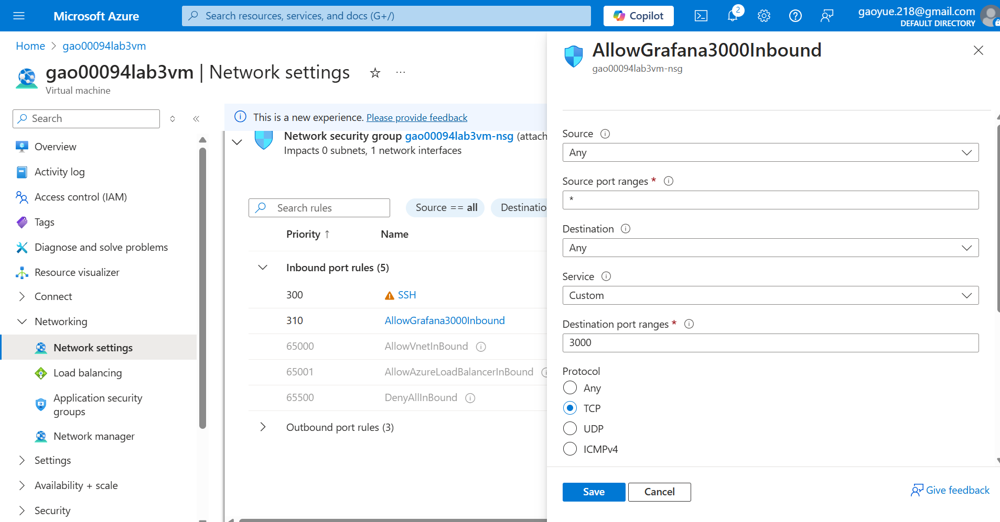
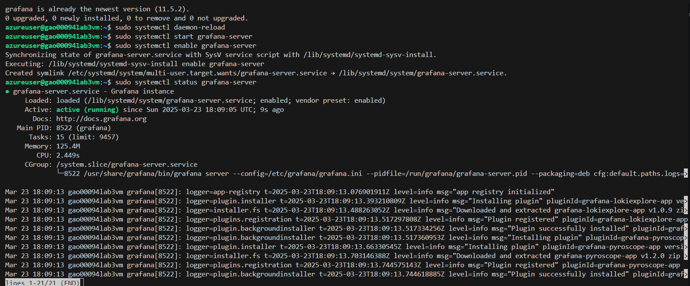
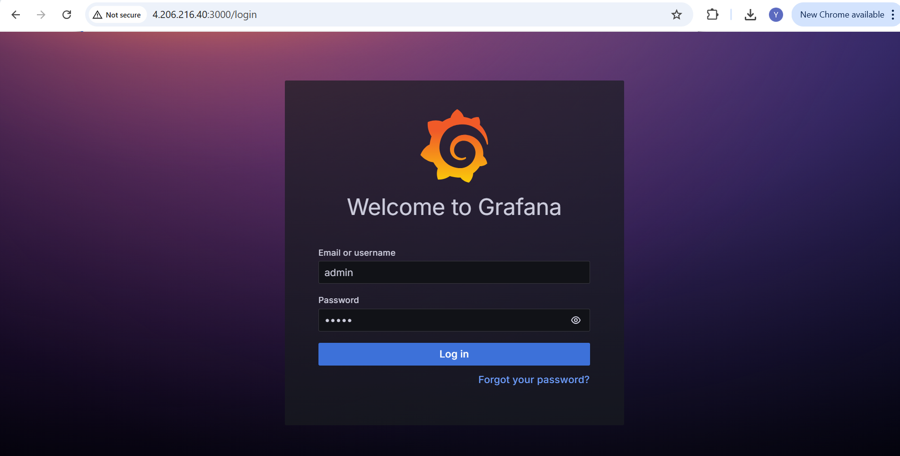
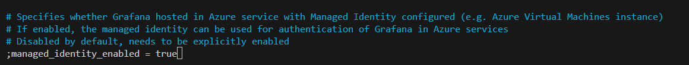
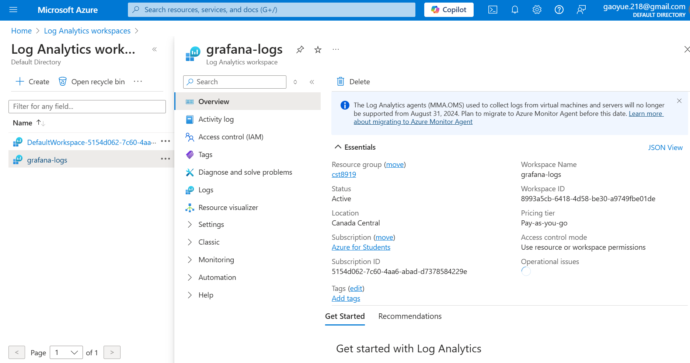
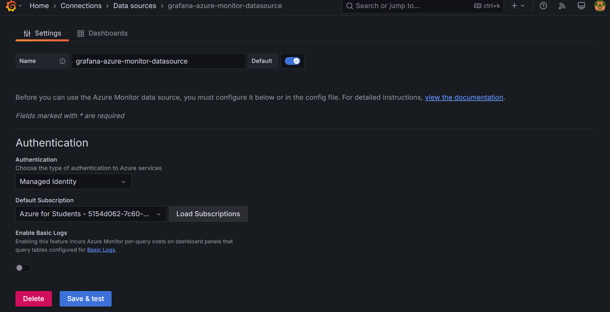
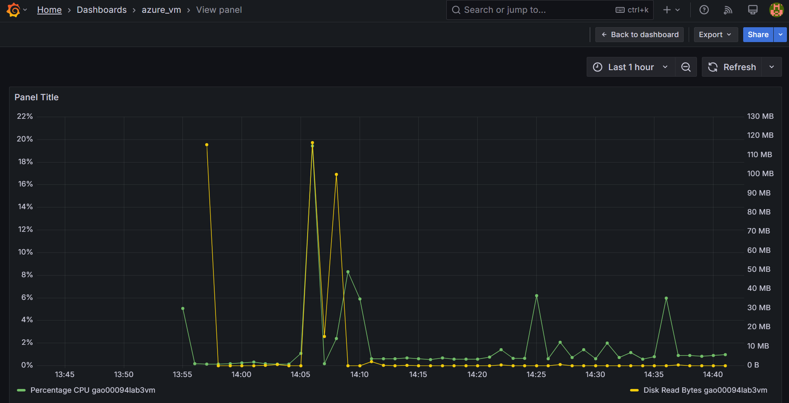
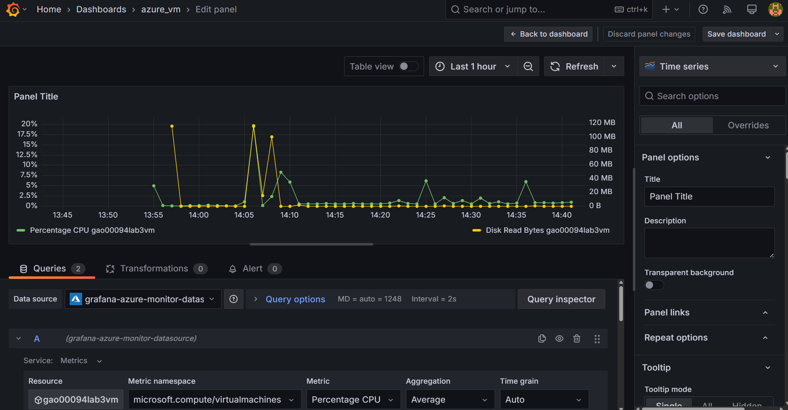

# cst8919-lab3-gao00094

### Create an Azure Virtual Machine

### Enable Port 3000

### Enable Managed Identity in your Grafana VM

### Create the log workspace

### Add data source

### Create Dashboard

